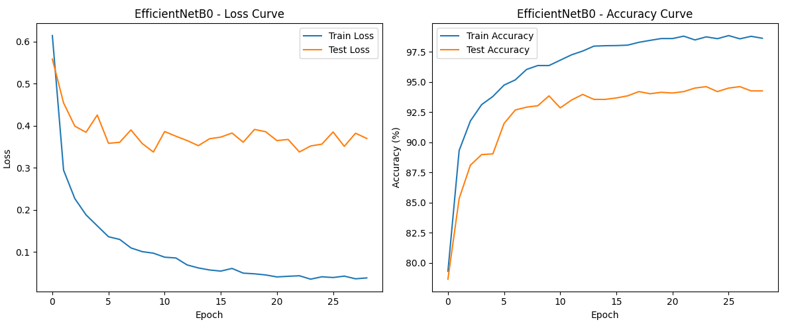

# Brain Tumor Detection using EfficientNetB0

## Overview

This project focuses on the automatic detection and classification of brain tumors from MRI scans using deep learning techniques.  
A fine-tuned EfficientNetB0 model is employed through transfer learning to distinguish between healthy and tumorous brain MRI images.  
The goal is to provide an accurate, efficient, and interpretable model for medical image classification.

---

## Objective

The model classifies MRI brain images into four distinct categories:

- No Tumor  
- Glioma Tumor  
- Meningioma Tumor  
- Pituitary Tumor  

The dataset used in this work is a combination of two publicly available MRI datasets from Kaggle:
1. Brain Tumor Classification (Sartaj Bhuvaji)
2. Brain Tumor MRI Dataset (Masoud Nickparvar)

Combining these datasets provided a more balanced and diverse training set, improving model generalization.

---

## Model Architecture

### EfficientNetB0

EfficientNetB0 is a convolutional neural network designed by Google AI.  
It is known for achieving high accuracy while maintaining computational efficiency through a compound scaling strategy that uniformly scales the network’s depth, width, and resolution.

In this project:
- The EfficientNetB0 model pretrained on ImageNet serves as the base.  
- The initial convolutional layers are frozen to preserve general visual features such as shapes and edges.  
- The deeper layers are fine-tuned on MRI images to learn medical-specific representations.  
- The original classification head is replaced by a custom fully connected layer that outputs four classes corresponding to the tumor types.

This architecture allows the model to leverage pretrained knowledge while adapting effectively to the medical imaging domain.

---

## Training Methodology

### Data Preparation and Augmentation

To improve generalization and reduce overfitting, several data augmentation techniques were applied:
- Random rotation up to 15 degrees  
- Random cropping and resizing to 224 × 224 pixels  
- Horizontal flipping  
- Slight brightness and contrast variations  
- Normalization using ImageNet mean and standard deviation  

The dataset is divided into training and testing subsets, each containing the four tumor classes in balanced proportions.

### Training Configuration

The model was trained using the Adam optimizer with a learning rate of 1e-4 and weight decay regularization.  
A learning rate scheduler (ReduceLROnPlateau) was used to dynamically reduce the learning rate when the validation loss stopped improving.  
Training was conducted for up to 30 epochs with early stopping to prevent overfitting when no improvement was observed for five consecutive epochs.  
All experiments were executed on a GPU to accelerate computation.

---

## Evaluation and Results

The model achieved an overall **accuracy of 94%** on the test set.  
Performance metrics, including precision, recall, and F1-score, were computed for each tumor category as shown below.

| Class             | Precision | Recall | F1-Score | Support |
|-------------------|------------|---------|-----------|----------|
| Glioma Tumor      | 0.99       | 0.81    | 0.89      | 400      |
| Meningioma Tumor  | 0.87       | 1.00    | 0.93      | 421      |
| No Tumor          | 0.94       | 1.00    | 0.97      | 510      |
| Pituitary Tumor   | 1.00       | 0.94    | 0.97      | 374      |
| **Overall Accuracy** | **0.94** | — | — | **1705** |
| **Macro Average** | 0.95 | 0.94 | 0.94 | 1705 |
| **Weighted Average** | 0.95 | 0.94 | 0.94 | 1705 |

The results indicate that the model performs consistently across all tumor categories.  
Glioma detection shows slightly lower recall (0.81), meaning a few glioma samples were misclassified, while the other tumor types achieve near-perfect recognition.  
High macro and weighted averages confirm that the model maintains balanced precision and recall across all classes.

### Accuracy and Loss Curves

The following figure shows the evolution of training and validation loss and accuracy over the training epochs:

---

## Model Interpretability

Model interpretability was achieved using the Grad-CAM (Gradient-weighted Class Activation Mapping) technique.  
Grad-CAM generates heatmaps that visualize which regions of the image contributed most to the model’s decision, offering transparency in medical predictions.

Below are examples illustrating Grad-CAM visualizations applied to MRI images.

### Glioma Tumor Example

|  

### Meningioma Tumor Example

|  
The Grad-CAM maps confirm that the model focuses on the tumor regions within the MRI scans rather than unrelated background details, demonstrating meaningful interpretability.

---

## Conclusion

This work demonstrates that transfer learning with EfficientNetB0 provides an effective solution for brain tumor detection from MRI scans.  
The model achieves high classification accuracy and can be visually interpreted using Grad-CAM, which enhances trust in medical AI systems.  
Future work could include expanding the dataset, testing other EfficientNet variants, or integrating attention mechanisms for even more precise localization.

---

## Author

Nawfal Benhamdane  
Email: nawfal.benhamdane@student-cs.fr
